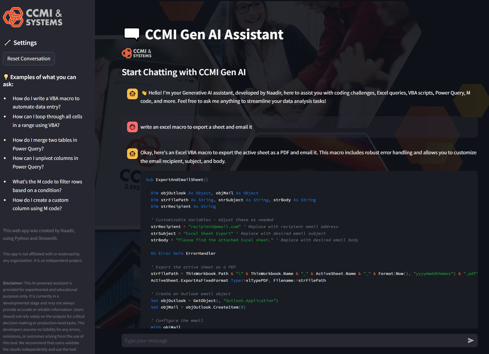

# AI Chatbot Assistant built for the CCMI Team

🗨️ **AI Chatbot Assistant** is a Streamlit application designed to help data analysts with coding challenges, Excel queries, VBA scripts, Power Query, M code, and more. The assistant leverages **Google's Gemini 1.5 Flash model** to provide insightful and helpful responses.

---

## 👨‍💻 Author Information

| Name        | Technology Used               | Model Used        | Year  |
|-------------|-------------------------------|-------------------|--------|
| Naadir D    | Python, Streamlit, Google AI  | Gemini 1.5 Flash  | 2024   |

(An independent development project)
---

## ✨ Features

- Interactive chat interface for data analysis assistance.
- Specialized in:
  - VBA questions
  - Power Query
  - M code
  - Excel queries
- Powered by Google Gemini 1.5 Flash model.
- Customizable and extensible codebase.
- Responsive design that adapts to dark and light themes.

---

### Prerequisites

- Python 3.7 or higher
- A Google API key for Gemini AI (Generative AI)
- Streamlit installed (`pip install streamlit`)
